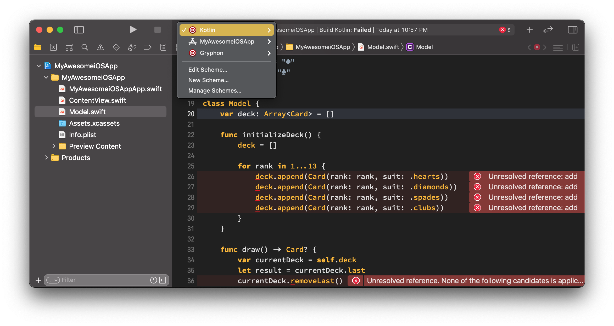

# Building the Android app using Xcode

Let's continue developing our app. Add the following code to `Model.swift`:

```` swift
class Model {
    var deck: Array<Card> = []

    func initializeDeck() {
        deck = []

        for rank in 1...13 {
            deck.append(Card(rank: rank, suit: .hearts))
            deck.append(Card(rank: rank, suit: .diamonds))
            deck.append(Card(rank: rank, suit: .spades))
            deck.append(Card(rank: rank, suit: .clubs))
        }
    }

    func draw() -> Card? {
        var currentDeck = self.deck
        let result = currentDeck.last
        currentDeck.removeLast()
        return result
    }
}
````

In Xcode, switch to the Gryphon target if needed and hit build (**⌘ + B**) to translate the new code. You'll see Gryphon raises a few warnings, but we have bigger problems at the moment: if you switch to Android Studio and tell it to build the app, it'll say the translated code has a few errors.

We could try to fix these problems in Android Studio, where we can see what the errors are, but our changes would be overwritten as soon as we translated the Swift code again. Ideally, warnings and errors in the translated Kotlin code would be reported in the Swift lines that generated the errors, so that we could fix them at the source. This can be done using the `Kotlin` target in Xcode - we just have to tell Gryphon where our Android app is located.

To do that, open the `local.config` file (Gryphon created it when you ran `gryphon init`). This file currently contains only one configuration, which says that the root of our Android app (the `ANDROID_ROOT`) is at the `../Android` directory - but in our case, this should be `../MyAwesomeAndroidApp`. Just change the directory path to `../MyAwesomeAndroidApp` and Gryphon will know where to look.

Note that this file is called `local.config` because it's meant to contain file paths for your local computer. If you work in the same project with other people, keep this file out of your git repository so that each developer can set the correct paths for their own computers.

Once the path in the configuration file is fixed, switch to the `Kotlin` target and hit build (**⌘ + B**). Xcode should report the Android errors at the correct place in the Swift code now:



## Bonus: creating your own path variables

Gryphon looks for the `ANDROID_ROOT` configuration in your `local.config` file when building your Kotlin code, but you can also use that file to specify any other configurations you want. For instance, we could create a new `ANDROID_SOURCES` variable right below the `ANDROID_ROOT`:

````
ANDROID_ROOT = ../MyAwesomeAndroidApp
ANDROID_SOURCES = ../MyAwesomeAndroidApp/app/src/main/java/com/example/myawesomeandroidapp
````

...and then use this variable on the `// gryphon output` comment at the top of the `Model.swift` file:

```` swift
// gryphon output: ANDROID_SOURCES/Model.kt
````

This makes the comment shorter and easier to understand, and allows other developers to set their own file paths according to their preferred file structure.


---

*Next: [Adding the Gryphon libraries](addingTheGryphonLibraries.html)*


